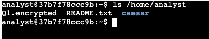
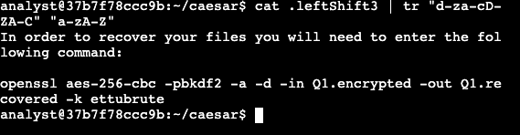
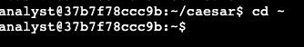
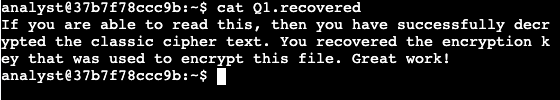

# Task 1 Read the contents of a file

Please review the following image below where I'll start the activity at my home directory, **/home/analyst**. In order to explore and read the contents of a file to get further instructions
I'll use the **ls** command to list the files in the working directory. When the command is entered two files, **Qi.encrypted** and **README.txt**, and a subdirectory, **caesar**, are listed.

## Decrypt Image Assessment – Evidence

There's an important message within the **README.txt** with instructions that I must follow. I used the cat command to list the contents of the **README.txt** file, in order to 
display the following output.

## Decrypt Image Assessment – Evidence

There's a message in the **README.txt** file that states there's a hidden file in the **caesar** subdirectory. 

# Task 2 Find a hidden file

In order for me to find a hidden file in my home directory and decrypt the **caesar** cipher it contains, I first used the cd command to change the **caesar** subdirectory of 
my home directory. I used ls **-a** command to list all the files, and the hidden files, in my hoome directory, displaying the output **. .. .leftShift3**. In Lynix, hidden files
can be identified by their name starting with a period **(.)**.

## Decrypt Image Assessment – Evidence

I used the cat command to list the contents of the **.leftShift3** file and the message is scrambled, because the data has been encrypted using the **caesar** cipher. The cipher can
be solved by shifting each alphabet character to the left or right by a fixed number of spaces. The shift is three ;etters to the left. Thus, "d" stands for "a"
and "e" stands for "b".

## Decrypt Image Assessment – Evidence

I can decrypt the **caesar** cipher in the **.leftShift3** fie using the **cat .leftShift3 | tr "d-za-cD-ZA-C" "a-zA-Z"** and will display the following output in the image below:

"In order..."

**openssl aes-256-cbc -pbkdf2 -a -d -in Q1.encrypted -out Q1.recover -k ettubrute**

## Decrypt Image Assessment – Evidence

In order to return to my home directory I use the **cd ~ command**.

## Decrypt Image Assessment – Evidence

# Task 3 Decrypt a file

In order to decrypt a file ad recover my data to read the message inside I need to use the **.leftShift3** using the same command used previously

**openssl aes-256-cbc -pbkdf2 -a -d -in Q1.encrypted -out Q1.recover -k ettubrute**

 - **openssl** command reverses the encryption of the file with a secure symmetric cipher, shows by **AES-256-CBC**.

 - **-pbkdf2** is used to add extra security key and a **-a** indicates the desires encoding for the output.

 - **-d** indicates decrypting.

 - **-in** specifies the input file

 - **-out** specified the output file.

 - the **-k** specifies the password, in this example it shows as **ettubrute**.

## Decrypt Image Assessment – Evidence

I used the **ls** command in order to list the contents of my working directory.

## Decrypt Image Assessment – Evidence

Then, I used the **cat command** to list those contents within the **Q1.recovered** file. The following output shows the contents within the file in the image below.

