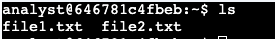
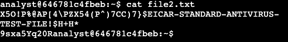
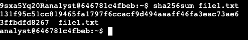
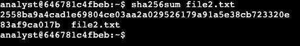
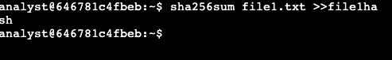
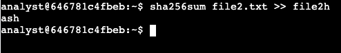
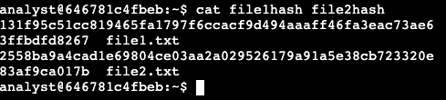
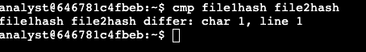

# Create hash values

Task 1 Generate Hashes for Files

Entering my home directory **/home/analyst I notice it contains two files **file1.txt** and **file2.txt**. Both files contain the same information inside.

I used **ls** coomand to list the contents in this directory.

## Hash Values Assessment – Evidence

I used the **cat** command to show the contents of the **file1.txt** and **file2.txt documemnts and noted they're both identical when I use the **cat** command to display the file's data.

## Hash Values Assessment – Evidence

Then, I used the **sha256sum** command in order to generate the hash for **file1.txt** document.

## Hash Values Assessment – Evidence

I used the **sha256sum** command to generate the hash for the **file2.txt** file as well, noting that both files have generated different hash values.

## Hash Values Assessment – Evidence

Task 2 Compare hashes

I used the **sha256sum** to generate the hash for **file1.txt**, in order to send an output to a new file called **file1hash** and **file2hash**. Please review the image below to search the command.

## Hash Values Assessment – Evidence

## Hash Values Assessment – Evidence

I used the **cat** command to show the hash values in the **file1hash** and **file2hash** documents.

## Hash Values Assessment – Evidence

Lastly, I used the **cmp** command to compare the two files byte per byte. If there is a difference in the files the command will report the byte and nuber where the difference was found. According to the output of the **cmp** command it shows 
the hashes are different at the first character in the first line. In otherwords, **file1.txt** is different from **file2.txt**.

## Hash Values Assessment – Evidence

