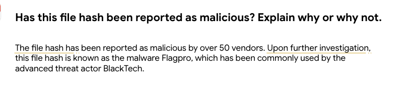
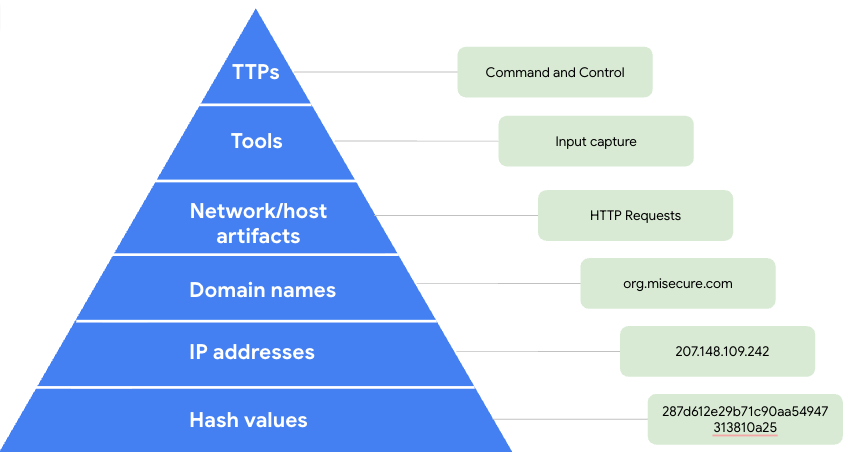

# Activity: Investigate a suspicious file hash

# Assessment 
 
## Step 1

The Community Score and the Security vendors' analysis listed in the VirusTotal report provide insight into the file and more than fifty security vendors have flagged this file as malicious. The file has also been categorized as Flagpro malware.

## Step 2 

The images below will provide an example for each field in the pyramid, in this activity I only need to include 3 IoC examples. I used the Details, Relations, and Behavior tabs, in order to find additional IoCs related to the file such as: a domain names, IP addresses, hash values, network or host artifacts, tools, and tactics, techniques, and procedures (TTPs).

•Domain names: org.misecure.com; reported as a malicious contacted domain under the Relations tab in the VirusTotal report.

•	IP address: 207.148.109.242; listed as one of many IP addresses under the Relations tab in the VirusTotal report, also associated with the org.misecure.com domain as listed in the DNS Resolutions section under the Behavior tab from the Zenbox sandbox report.

•	Hash value: 287d612e29b71c90aa54947313810a25 is a MD5 hash listed under the Details tab in the VirusTotal report.

•	Network/host artifacts: those observed in this malware are HTTP requests made to the org.misecure.com domain. 

•	Tools: Input capture is listed in the Collection section under the Behavior tab from the Zenbox sandbox report; input captures are used by malicious actors to steal user input such as passwords, credit card numbers, and other sensitive information.

•	TTPs: Command and control is listed as a tactic under the Behavior tab from the Zenbox sandbox report. Malicious actors use command and control to establish communication channels between an infected system and their own system.

Conclusion

In this activity, I determined that a file was malicious using information from a VirusTotal report, also identified indicators of compromise associated with this file. Analysts will use investigative tools like VirusTotal to access threat intelligence to add context to investigations and learn more about threats when investigating a possible security incident.

