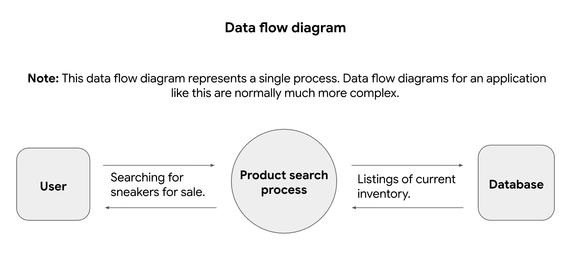
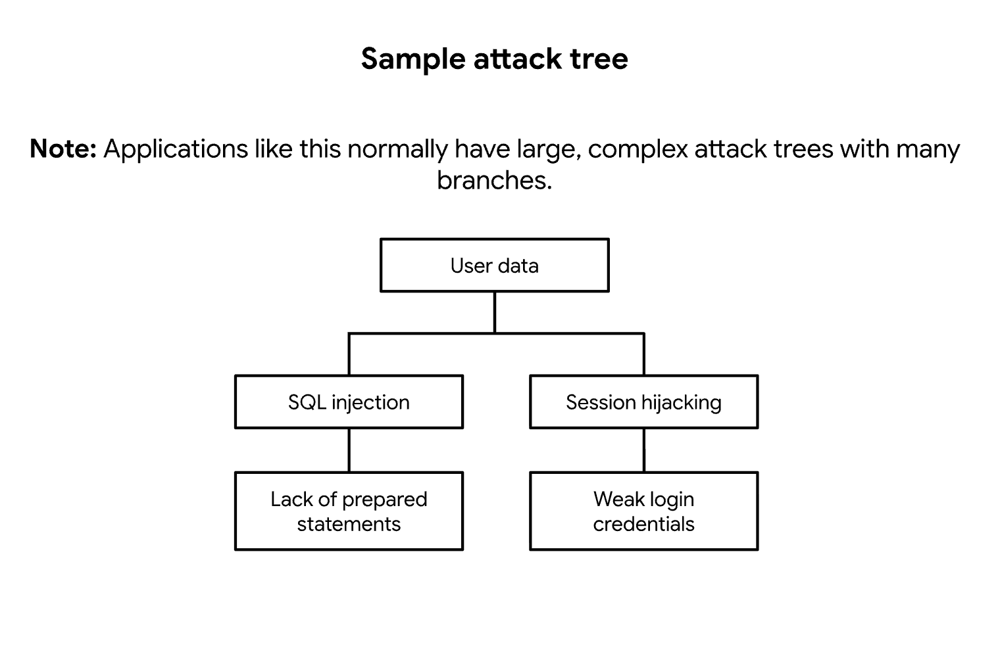

# PASTA worksheet

I. Define business and security objectives

Make 2-3 notes of specific business requirements that will be analyzed.

●	The user can create member profiles internally or external accounts.

●	The app must process financial transactions.

●	The app should be in compliance with PCI-DSS.

II. Define the technical scope

List of technologies used by the application:

●	Application programming interface (API)

●	Public key infrastructure (PKI)

●	SHA-256

●	SQL

III. Decompose application

IV. Threat analysis

List 2 types of threats in the PASTA worksheet that are risks to the information being handled by the application.

●	Injection

●	Session hijacking

V. Vulnerability analysis

List 2 vulnerabilities in the PASTA worksheet that could be exploited.

●	Lack of prepared statements

●	Broken API token

VI. Attack modeling

VII. Risk analysis and impact

List 4 security controls that can reduce risk.
SHA-256, incident response procedures, password policy, principle of least privilege

